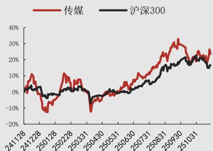

# 11月游戏版号过审184款，西山居《星砂岛》布局生活模拟赛道

传媒行业快评报告

# 强于大市 (维持)

2025年11月28日

# 行业事件：

2025年11月27日国家新闻出版署公告11月份国产游戏版号及进口游戏版号，共有178款国产游戏和6款进口游戏过审。

# 投资要点：

11月游戏版号发放量创新高，涵盖多类型产品与知名厂商。年初至今国产游戏合计通过审批1532款，11月份游戏版号发放量创今年新高，通过审批178款，包括B站《闪耀吧！噜咪》、完美世界《梦幻新诛仙：轻享》、雷霆《再世仙途》、四三九九《造梦西游之黎尤浩劫篇》、恺英网络《冰雪王者》、星辉《神荒太墟》、冰川网络《小小护卫队》、西山居《星砂岛》等；年初至今进口游戏合计通过审批93款，11月份通过审批6款，其中包括了成都牧雅辰科技《韵律源点》、西安西品网络《百战天虫》等。11月份游戏版号中，以下作品受到市场关注：

《星砂岛》主打海岛题材，生活模拟赛道竞争将会较为激烈。《星砂岛》出自金山与西山居投资的SEED LAB工作室，是一款以亚热带岛屿为背景的乡村生活模拟游戏，内容包括钓鱼、畜牧养殖、遗迹探索、宠物等。游戏此前曾先后亮相XBOX科隆发布会与东京电玩展发布会，并在Steam上发布过Demo版本，截至11月13日，愿望单数量已突破40万。我们认为在2026年生活模拟赛道竞争将会较为激烈，大型游戏厂商纷纷布局，例如米哈游《星布谷地》、腾讯《粒粒小人国》、网易《星绘友晴天》等，《星砂岛》能否成功突围在于突出差异化以及发挥PS5、Xbox等多平台优势。

投资建议：2025年11月游戏版号发放量创新高，结构覆盖多类型产品。整体来看，供给端延续释放，版号常态化趋势稳固，行业修复节奏持续推进。建议关注具备产品储备、研发能力及题材多样化布局能力的头部厂商。

风险因素：政策监管风险、版号核发节奏不及预期、新游延期上线及表现不及预期、新游流水不及预期、出海业务风险加剧、商誉减值风险。

行业相对沪深300指数表现
### 图片标题：传媒板块与沪深300指数走势对比图
图片描述：该图表为一条折线图，展示了传媒板块指数与沪深300指数在一段时间内的相对表现。横轴表示时间，从2024年1月28日（241128）至2025年3月1日（251031），以日期编号形式标注，间隔约为一个月；纵轴表示收益率，范围从-20%到40%，单位为百分比。图中包含两条折线：红色实线代表“传媒”板块的累计收益率变化，黑色实线代表“沪深300”指数的累计收益率变化。两条线均呈现波动上升趋势，其中传媒板块整体涨幅高于沪深300指数，尤其在2025年初出现明显拉升，最高接近30%。沪深300指数则相对平稳，最高约20%。两条曲线在多个时间段出现交叉，显示两者表现时有领先与落后。整体来看，传媒板块在该周期内表现出较强的上涨动能，但波动性也较大。

数据来源：聚源，万联证券研究所

# 相关研究

IP价值深挖，拉动衍生品市场新引擎

10月游戏版号过审166款，鹰角网络《明日方舟》客户端获批

9月游戏版号发放量维持高位，米哈游崩坏

IP新作《崩坏：因缘精灵》获批

分析师： 夏清莹

执业证书编号： S0270520050001

电话： (0755)83223620

邮箱： xiaqy1@wlzq.com.cn

分析师： 李中港

执业证书编号： S0270524020001

电话： 17863087671

邮箱： lizg@wlzq.com.cn

# 行业投资评级

强于大市：未来6个月内行业指数相对大盘涨幅 10% 以上；

同步大市：未来6个月内行业指数相对大盘涨幅 10% 至 -10% 之间；

弱于大市：未来6个月内行业指数相对大盘跌幅 10% 以上。

# 公司投资评级

买入：未来6个月内公司相对大盘涨幅 15% 以上；

增持：未来6个月内公司相对大盘涨幅 5% 至 15%

观望：未来6个月内公司相对大盘涨幅 -5% 至 5%

卖出：未来6个月内公司相对大盘跌幅 5% 以上。

基准指数：沪深300指数

# 风险提示

我们在此提醒您，不同证券研究机构采用不同的评级术语及评级标准。我们采用的是相对评级体系，表示投资的相对比重建议；投资者买入或者卖出证券的决定取决于个人的实际情况，比如当前的持仓结构以及其他需要考虑的因素。投资者应阅读整篇报告，以获取比较完整的观点与信息，不应仅仅依靠投资评级来推断结论。

# 证券分析师承诺

本人具有中国证券业协会授予的证券投资咨询执业资格并登记为证券分析师，以勤勉的执业态度，独立、客观地出具本报告。本报告清晰准确地反映了本人的研究观点。本人不曾因，不因，也将不会因本报告中的具体推荐意见或观点而直接或间接收到任何形式的补偿。

# 免责条款

万联证券股份有限公司（以下简称“本公司”）是一家覆盖证券经纪、投资银行、投资管理和证券咨询等多项业务的全国性综合类证券公司。本公司具有中国证监会许可的证券投资咨询业务资格。

本报告仅供本公司的客户使用。本公司不会因接收人收到本报告而视其为客户。在任何情况下，本报告中的信息或所表述的意见并不构成对任何人的投资建议。本报告中的信息或所表述的意见并未考虑到个别投资者的具体投资目的、财务状况以及特定需求。客户应自主作出投资决策并自行承担投资风险。本公司不对任何人因使用本报告中的内容所导致的损失负任何责任。在法律许可情况下，本公司或其关联机构可能会持有报告中提到的公司所发行的证券头寸并进行交易，还可能为这些公司提供或争取提供投资银行、财务顾问或类似的金融服务。

市场有风险，投资需谨慎。本报告是基于本公司认为可靠且已公开的信息撰写，本公司力求但不保证这些信息的准确性及完整性，也不保证文中的观点或陈述不会发生任何变更。在不同时期，本公司可发出与本报告所载资料、意见及推测不一致的报告。分析师任何形式的分享证券投资收益或者分担证券投资损失的书面或口头承诺均为无效。

本报告的版权仅为本公司所有，未经书面许可任何机构和个人不得以任何形式翻版、复制、刊登、发表和引用。未经我方许可而引用、刊发或转载的引起法律后果和造成我公司经济损失的概由对方承担，我公司保留追究的权利。

# 万联证券股份有限公司 研究所

上海浦东新区世纪大道1528号陆家嘴基金大厦

北京西城区平安里西大街28号中海国际中心

深圳福田区深南大道2007号金地中心

广州天河区珠江东路11号高德置地广场